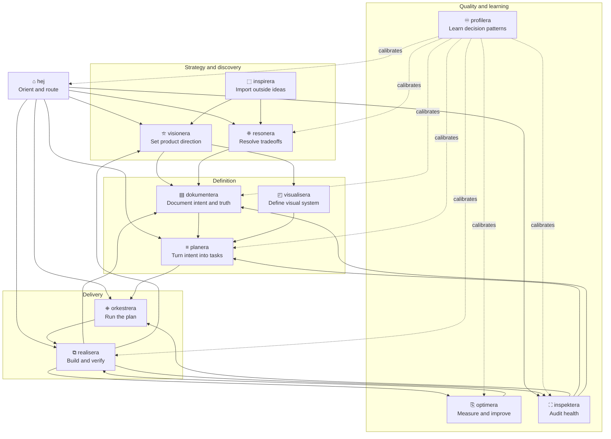

<div align="center">
<pre>
┌─┐┌─┐┌─┐┌┐┌┌┬┐┌─┐┬─┐┌─┐
├─┤│ ┬├┤ │││ │ ├┤ ├┬┘├─┤
┴ ┴└─┘└─┘┘└┘ ┴ └─┘┴└─┴ ┴
</pre>

<strong>Skill suite</strong> for autonomous software development.

</div>

## Install

```bash
npx skills install -g jgabor/agentera
```

Installs all 12 skills through the Skills CLI. Runtime-native loading support varies by host.

The Skills CLI path is the cross-runtime install path. Native plugin commands are runtime-specific distribution paths; direct skill folders are local-authoring fallbacks that load the existing `skills/<name>/SKILL.md` directories.

### Runtime support

| Runtime | Distribution install | Local skill-folder fallback | Discovery | Invocation | Hook support |
|---------|----------------------|-----------------------------|-----------|------------|--------------|
| Claude Code | Add the marketplace, then install the plugin: `claude plugin marketplace add <source>` and `claude plugin install <plugin>@<marketplace>` | Skills CLI or Claude Code skill paths using `skills/<name>/SKILL.md` | Claude Code skill/plugin discovery; validate plugin metadata with `claude plugin validate .` | `/hej`, `/realisera`, etc. | Full lifecycle support |
| OpenCode | Local plugins load from `.opencode/plugins/` or `~/.config/opencode/plugins/`; hook plugin is `.opencode/plugins/agentera.js` | `.opencode/skills`, `.claude/skills`, `.agents/skills`, or global equivalents | Native `skill` tool lists available skills | Loaded by name through the `skill` tool | Full lifecycle support via plugin |
| Copilot CLI | Verified marketplace install is preferred when a canonical source exists: `copilot plugin install <plugin>@<marketplace>`; no canonical Agentera marketplace source is currently verified. Deprecated fallback: `OWNER/REPO`, `OWNER/REPO:PATH`, Git URL, or local path | Project: `.github/skills`, `.agents/skills`, `.claude/skills`; personal: `~/.copilot/skills`, `~/.agents/skills`, `~/.claude/skills` | `/skills list`, `/skills info`, `/skills reload`; marketplaces via `copilot plugin marketplace add/list/browse/remove` | `/hej`, `/realisera`, etc. | Partial lifecycle support |
| Codex CLI | Interactive `/plugins`; marketplace sources managed with `codex plugin marketplace add`, `upgrade`, or `remove` | Repo: `.agents/skills`; user: `$HOME/.agents/skills`; admin: `/etc/codex/skills` | `/skills`; plugins via `/plugins` | `$hej`, `$realisera`, etc. | Experimental hooks only; no parity |

Copilot and Codex metadata point at the shared `skills/<name>/SKILL.md` source. `profilera` is capability-gated in native metadata because it depends on runtime-specific Section 21 corpus surfaces; missing source families degrade into corpus metadata instead of blocking supported extraction.

Claude Code plugin metadata is namespaced and the marketplace manifest lives at `.claude-plugin/marketplace.json`. There is no `claude plugin add` command in the local CLI evidence; use the marketplace add plus plugin install flow above.

Copilot plugin management supports `copilot plugin install`, `copilot plugin list`, and `copilot plugin marketplace add/list/browse/remove`. Prefer verified marketplace installs when a canonical source is available; `<plugin>@<marketplace>` is Copilot syntax, not evidence that Agentera is published in a marketplace. Current host evidence found only the built-in `copilot-plugins` and `awesome-copilot` marketplaces, with no `agentera` entry. Direct repo, Git URL, and local path installs currently work but Copilot warns they are deprecated. The current-checkout plugin manifest is `plugin.json`, so `copilot --plugin-dir <repo>` loads shared `skills/` without escaping the plugin root.

Codex presentation metadata uses Codex conventions: inspect skills with `/skills`, inspect plugins with `/plugins`, and invoke explicitly with `$skill`, for example `$hej`. Per-skill metadata lives at `skills/<name>/agents/openai.yaml`. Direct `.agents/skills` folders are the local-authoring fallback, not the marketplace install path. Portable skills allow implicit invocation. `profilera` disables implicit invocation in its per-skill Codex metadata because profile extraction remains corpus-dependent and reports missing source families as degraded metadata.

OpenCode reads skills from `.opencode/skills`, `.claude/skills`, `.agents/skills`, and global equivalents. For local plugin loading, place plugins in `.opencode/plugins/` or `~/.config/opencode/plugins/`.

### Lifecycle hooks (optional)

Hooks add session context preload, artifact validation, and session bookmarks. Without hooks, portable skills still read and write the same markdown artifacts.

| Runtime | Session preload | Artifact validation after edits | Session bookmark | Status |
|---------|-----------------|----------------------------------|------------------|--------|
| Claude Code | Active | Active via PostToolUse | Active | Full lifecycle support |
| OpenCode | Active via plugin | Active via `tool.execute.after` | Active via session events | Full lifecycle support |
| Copilot CLI | Partial via `sessionStart` command handler | Partial via `postToolUse` command handler when supported by host metadata | Partial via `agentStop` command handler | Adapter metadata only; not Claude hook parity |
| Codex CLI | Experimental behind `[features] codex_hooks = true` | Unsupported for real-time Write/Edit interception parity | Experimental behind `[features] codex_hooks = true` | Disabled on Windows; no real-time artifact validation claim |

Do not assume hook parity between runtimes. Codex skill loading can be portable before Codex lifecycle hooks can enforce real-time artifact validation.

Copilot lifecycle metadata is adapter strategy, not a Claude hook copy. Repo hook files live under `.github/hooks/*.json`; command hooks use `bash`, `powershell`, `cwd`, `env`, and `timeoutSec`. Treat support as partial unless manifest validation proves a specific hook path.

Codex metadata advertises lifecycle limitations only. Codex hooks are experimental behind `[features] codex_hooks = true`, are disabled on Windows, and do not provide current Write/Edit interception parity.

### Hook setup

Hooks are optional. Install them only where the host runtime supports equivalent lifecycle events.

**Claude Code**: hooks auto-load from the installed skill directory. No extra step.

**OpenCode**: copy the hook plugin:

```bash
curl -fsSL https://raw.githubusercontent.com/jgabor/agentera/main/.opencode/plugins/agentera.js \
  -o ~/.config/opencode/plugins/agentera.js
```

### Alternative install methods

**Claude Code plugin marketplace**:

```bash
claude plugin marketplace add <source>
claude plugin install <plugin>@<marketplace>
```

Validate local plugin metadata with:

```bash
claude plugin validate .
```

**Copilot plugin**:

```bash
copilot plugin install <plugin>@<marketplace>
```

This command shows Copilot's marketplace syntax only. No canonical Agentera Copilot marketplace source is currently verified. When one is verified, use that source to install the aggregate `agentera` plugin.

Use `copilot plugin marketplace list` to inspect available marketplaces. Direct installs such as `copilot plugin install OWNER/REPO`, `OWNER/REPO:PATH`, Git URLs, and local paths are deprecated fallback paths when no verified marketplace source is available.

After a successful aggregate install, `copilot plugin list` should show the `agentera` plugin. Older per-skill entries such as `hej@agentera` may also appear if they were installed through earlier metadata. Host discovery can differ from install state: Task 4 observed `/skills list` exiting 0 while omitting installed `hej`, `inspektera`, and `profilera`.

After install, export `AGENTERA_HOME` in your shell rc so SKILL.md helper-script invocations resolve to the install root:

```bash
echo 'export AGENTERA_HOME=<plugin install root>' >> ~/.bashrc  # or ~/.zshrc
```

Substitute `<plugin install root>` with the directory that contains `scripts/`, `hooks/`, `skills/`, and `SPEC.md` for your install. Copilot CLI has no plugin-level env-injection mechanism (the [CLI plugin reference](https://docs.github.com/en/copilot/reference/copilot-cli-reference/cli-plugin-reference) defines no `env` field, and the [hooks reference](https://docs.github.com/en/copilot/reference/hooks-configuration) marks hook stdout `Ignored`), so Copilot inherits the parent shell environment instead. SPEC.md Section 7 defines the contract.

**Codex plugin marketplace**: use interactive `/plugins` to install and enable plugins. Manage marketplace sources with `codex plugin marketplace add|upgrade|remove`.

After install, add `AGENTERA_HOME` to `~/.codex/config.toml` so Codex injects it into every shell-tool subprocess:

```toml
[shell_environment_policy]
set = { AGENTERA_HOME = "<plugin install root>" }
```

Substitute `<plugin install root>` with the directory that contains `scripts/`, `hooks/`, `skills/`, and `SPEC.md` for your install. `[shell_environment_policy]` is Codex's native, non-experimental mechanism for shell-tool env propagation; see the [Codex config reference](https://developers.openai.com/codex/config-reference) and the `ShellEnvironmentPolicyToml` entry in the [config schema](https://github.com/openai/codex/blob/main/codex-rs/core/config.schema.json). SPEC.md Section 7 defines the contract.

**Manual (git clone)**:

```bash
git clone git@github.com:jgabor/agentera.git ~/.agents/agentera
```

Then link or reference `skills/<name>/SKILL.md` through your runtime's skill-folder mechanism. OpenCode requires each skill directory one level under a searched `skills` directory:

```bash
mkdir -p ~/.config/opencode/skills
for skill in ~/.agents/agentera/skills/*/; do
  ln -s "$skill" ~/.config/opencode/skills/$(basename "$skill")
done
```

> [!NOTE]
> `profilera` mines runtime-specific session data and remains adapter-specific per the [Section 21 Session Corpus Contract](./SPEC.md). Copilot CLI and Codex CLI collectors contribute available bounded source families to the unified corpus; missing families are reported as capability-gated degradation metadata. All other skills are portable through shared markdown artifacts. For OpenCode capability details, see [`references/adapters/opencode.md`](./references/adapters/opencode.md).

---

## Getting started

Type `/hej` and agentera reads your entire project (code, git history, open issues, health grades) and tells you where things stand:

```
┌─┐┌─┐┌─┐┌┐┌┌┬┐┌─┐┬─┐┌─┐
├─┤│ ┬├┤ │││ │ ├┤ ├┬┘├─┤
┴ ┴└─┘└─┘┘└┘ ┴ └─┘┴└─┴ ┴

─── status ─────────────────────────────

  ⛶ health    ⮉ B+ (testing: C)
  ⇶ issues    0 critical · 2 degraded · 5 annoying
  ≡ plan      [██████▓░░░] 6/10 tasks
  ♾ profile   loaded

  Shipped auth middleware and rate limiting last cycle.
  Health trending up, test coverage still lagging.

─── attention ──────────────────────────

  ⇉ test coverage below 60%, degrading since cycle 8
  ⇉ task 7 blocked on API schema decision

─── next ───────────────────────────────

  suggested → ❈ /resonera (resolve API schema to unblock task 7)
```

---

## How it works

Skills communicate through markdown files in your project: a vision doc, a plan, a health report, a decision log. Each skill reads what the others have written and acts on it. You don't manage these files; they build up naturally as you work.

Every skill suggests what to do next when it finishes. You follow the thread, or run `/orkestrera` to execute an entire plan: it dispatches skills, evaluates each task with inspektera, retries failures, and loops until done.



Together, the skills cover the full product loop: orient, discover, decide, document, design, plan, build, evaluate, optimize, and learn from each cycle.

### Example workflow

Continuing from the `/hej` output above (task 7 blocked on an API schema decision):

```
/resonera                                         decide
├─ Deliberates on the API schema tradeoffs
├─ Writes Decision 8 → DECISIONS.md
└─ Suggests → /planera

/planera                                           plan
├─ Reads the decision, breaks remaining work into 4 tasks
├─ Each task gets behavioral acceptance criteria
└─ Suggests → /orkestrera

/orkestrera                                        execute
├─ Task 7  → realisera builds → inspektera evaluates → PASS
├─ Task 8  → realisera builds → inspektera evaluates → PASS
├─ Task 9  → realisera builds → inspektera evaluates → FAIL → retry → PASS
├─ Task 10 → realisera builds → inspektera evaluates → PASS
├─ Plan complete. Runs full health audit.
└─ Health: B+ → A-
```

Each skill writes markdown artifacts (a vision, a plan, a health report, a decision log). The next skill reads what the last one wrote and acts on it. You don't manage these files; they build up naturally as you work. profilera watches how you make decisions and tunes every skill to your preferences over time.

## Skills

|     | Skill                                | What it does                                                                                                         |
| :-: | ------------------------------------ | -------------------------------------------------------------------------------------------------------------------- |
|  ⌂  | [hej](./skills/hej/)                 | **Entry point.** Reads your project state, shows what needs attention, suggests where to start.                     |
|  ⛥  | [visionera](./skills/visionera/)     | **Envision.** Defines and evolves your project's north star through codebase exploration and aspirational challenge. |
|  ❈  | [resonera](./skills/resonera/)       | **Deliberate.** Thinks through hard decisions via Socratic questioning before you commit.                           |
|  ⬚  | [inspirera](./skills/inspirera/)     | **Research.** Analyzes an external resource and maps its patterns to your project.                                  |
|  ≡  | [planera](./skills/planera/)         | **Plan.** Breaks work into tasks with clear done-criteria, scales from quick notes to full plans.                   |
|  ⧉  | [realisera](./skills/realisera/)     | **Build.** Autonomous development loop that picks up work, implements, verifies, and continues.                     |
|  ⎘  | [optimera](./skills/optimera/)       | **Tune.** Picks a metric, runs experiments, measures results, iterates until it improves.                           |
|  ⛶  | [inspektera](./skills/inspektera/)   | **Audit.** Audits code health across nine dimensions (architecture, patterns, coupling, complexity, tests, deps, versioning, artifact freshness, security), tracks trends over time. |
|  ▤  | [dokumentera](./skills/dokumentera/) | **Document.** Creates and maintains docs, tracks what's covered and what's missing.                                 |
|  ♾  | [profilera](./skills/profilera/)     | **Compounding memory.** Mines your decision patterns into a profile consumed by every skill, so the 20th cycle adapts to how you work in ways the 1st could not. |
|  ◰  | [visualisera](./skills/visualisera/) | **Visualize.** Creates and maintains a visual identity system for your project.                                     |
|  ⎈  | [orkestrera](./skills/orkestrera/) | **Orchestrate.** Dispatches skills as subagents, evaluates each with inspektera, loops through plans. |

<details>
<summary><strong>State artifacts reference</strong></summary>

<br>

Three project-facing files at root, nine operational files in `.agentera/`.

**Root (project-facing)**:

| Artifact       | Maintained by         | Consumed by                    |
| -------------- | --------------------- | ------------------------------ |
| `VISION.md`    | visionera, realisera  | realisera, planera, inspektera, dokumentera, visualisera, orkestrera |
| `TODO.md`      | realisera, inspektera | realisera, planera, orkestrera |
| `CHANGELOG.md` | realisera             | project contributors           |

**.agentera/ (operational)**:

| Artifact         | Maintained by | Consumed by                                         |
| ---------------- | ------------- | --------------------------------------------------- |
| `PROGRESS.md`    | realisera     | planera, inspektera, dokumentera, visionera, orkestrera                     |
| `DECISIONS.md`   | resonera      | planera, realisera, optimera, inspektera, profilera, orkestrera |
| `PLAN.md`        | planera       | realisera, inspektera, orkestrera                               |
| `HEALTH.md`      | inspektera    | realisera, planera, orkestrera                                  |
| `OBJECTIVE.md`   | optimera      | optimera                                            |
| `EXPERIMENTS.md` | optimera      | optimera                                            |
| `DESIGN.md`      | visualisera   | realisera, visionera                                |
| `DOCS.md`        | dokumentera   | all skills (path overrides)                         |
| `SESSION.md`     | session stop hook | session start hook, hej                         |

`PROFILE.md` is global. Profilera writes to `$PROFILERA_PROFILE_DIR/PROFILE.md` (defaulting to `$XDG_DATA_HOME/agentera/PROFILE.md` on Linux, platform-appropriate paths on macOS and Windows). Other runtimes override this via the `PROFILERA_PROFILE_DIR` environment variable or the host adapter contract.

</details>

## Scripts

Repo-level utilities live in `scripts/` and run from the repo root using only Python stdlib.

| Script | Purpose | Output |
|--------|---------|--------|
| `scripts/validate_spec.py` | Lints SKILL.md files against `SPEC.md`. Defaults to all 12 canonical skills; pass `--skill PATH` (repeatable) to validate arbitrary skills (third-party authoring). | exit code, stdout report |
| `scripts/eval_skills.py` | Tier 2 smoke-test runner that exercises skills via `claude -p`. Flags: `--dry-run`, `--skill <name>`, `--parallel <N>`. | stdout report |
| `scripts/usage_stats.py` | Reads the Section 21 corpus produced by `skills/profilera/scripts/extract_all.py` and reports per-skill invocation counts, exit-status pairings (complete/flagged/stuck/waiting/incomplete), and slash-vs-natural-language trigger splits. Flags: `--corpus PATH`, `--project PATH` (substring match against `project_id`), `--json`. Env: `AGENTERA_USAGE_DIR` overrides the output directory. | `USAGE.md` in the global agentera data directory (`~/.local/share/agentera/USAGE.md` on Linux, `~/Library/Application Support/agentera/USAGE.md` on macOS, `%APPDATA%/agentera/USAGE.md` on Windows) plus a brief stdout summary; `--json` mode prints the full payload to stdout and writes no file. Both surfaces include the script's run-at timestamp and the corpus's extracted-at timestamp. Missing or empty corpus exits non-zero with the extractor command in the message. |
