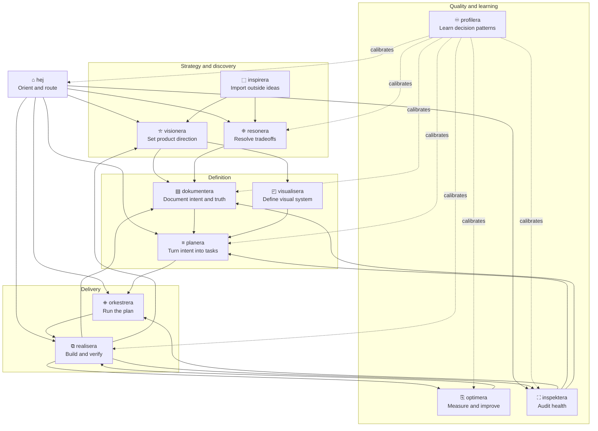

<div align="center">
<pre>
┌─┐┌─┐┌─┐┌┐┌┌┬┐┌─┐┬─┐┌─┐
├─┤│ ┬├┤ │││ │ ├┤ ├┬┘├─┤
┴ ┴└─┘└─┘┘└┘ ┴ └─┘┴└─┴ ┴
</pre>

<strong>Skill suite</strong> for autonomous software development.

</div>

## Install

```bash
npx skills install -g jgabor/agentera
```

Installs all 12 skills through the Skills CLI. Runtime-native loading support varies by host.

The Skills CLI path is the cross-runtime install path. Native plugin commands are runtime-specific distribution paths; direct skill folders are local-authoring fallbacks that load the existing `skills/<name>/SKILL.md` directories.

### Runtime support

| Runtime | Distribution install | Local skill-folder fallback | Discovery | Invocation | Hook support |
|---------|----------------------|-----------------------------|-----------|------------|--------------|
| Claude Code | Add the marketplace, then install the plugin: `claude plugin marketplace add <source>` and `claude plugin install <plugin>@<marketplace>` | Skills CLI or Claude Code skill paths using `skills/<name>/SKILL.md` | Claude Code skill/plugin discovery; validate plugin metadata with `claude plugin validate .` | `/hej`, `/realisera`, etc. | Full lifecycle support |
| OpenCode | Local plugins load from `.opencode/plugins/` or `~/.config/opencode/plugins/`; hook plugin is `.opencode/plugins/agentera.js` | `.opencode/skills`, `.claude/skills`, `.agents/skills`, or global equivalents | Native `skill` tool lists available skills | Loaded by name through the `skill` tool | Full lifecycle support via plugin |
| Copilot CLI | Verified marketplace path: `copilot plugin marketplace add jgabor/agentera` then `copilot plugin install <skill>@agentera` (granular) or `copilot plugin install jgabor/agentera` (umbrella). Both resolve against the same source; granular sidesteps the umbrella discovery bug `github/copilot-cli#2390`. Direct repo, Git URL, and local path installs work but Copilot warns they are deprecated | Project: `.github/skills`, `.agents/skills`, `.claude/skills`; personal: `~/.copilot/skills`, `~/.agents/skills`, `~/.claude/skills` | `/skills list`, `/skills info`, `/skills reload`; marketplaces via `copilot plugin marketplace add/list/browse/remove` | `/hej`, `/realisera`, etc.; `/fleet` enables user-driven parallel subagent execution | Partial lifecycle support: `preToolUse` blocks reconstructable artifact edits, `postToolUse` output is logging-only |
| Codex CLI | Verified marketplace path: `codex plugin marketplace add jgabor/agentera` then interactive `/plugins` to install. `multi_agent` and `codex_hooks` feature flags ship stable + default-on as of v0.124.0 (2026-04-23); `[agents.<name>]` config tables in `~/.codex/config.toml` provide the conversational dispatch substrate for orkestrera | Repo: `.agents/skills`; user: `$HOME/.agents/skills` (canonical user path; `~/.codex/skills` is the system-bundled cache); admin: `/etc/codex/skills` | `/skills`; plugins via `/plugins` | `$hej`, `$realisera`, etc. | Full lifecycle support via `codex_hooks`: real-time `apply_patch` Write/Edit interception per `openai/codex#18391` |

Copilot and Codex metadata point at the shared `skills/<name>/SKILL.md` source. `profilera` is capability-gated in native metadata because it depends on runtime-specific Section 22 corpus surfaces; missing source families degrade into corpus metadata instead of blocking supported extraction.

Claude Code plugin metadata is namespaced and the marketplace manifest lives at `.claude-plugin/marketplace.json`. There is no `claude plugin add` command in the local CLI evidence; use the marketplace add plus plugin install flow above.

Copilot plugin management supports `copilot plugin install`, `copilot plugin list`, and `copilot plugin marketplace add/list/browse/remove`. The agentera marketplace install path is verified working: `copilot plugin marketplace add jgabor/agentera` registers the source, then `copilot plugin install <skill>@agentera` (granular) or `copilot plugin install jgabor/agentera` (umbrella) installs against it. Granular install is currently recommended because umbrella discovery hits Copilot bug `github/copilot-cli#2390` (plugin from a GitHub repo with `.github/plugin/plugin.json` is not discovered when `cache_path` is the repo root). Default Copilot marketplaces (`github/copilot-plugins`, `github/awesome-copilot`) ship the built-in catalog; agentera's source is the user-added `jgabor/agentera` marketplace. The current-checkout plugin manifest is `plugin.json`, so `copilot --plugin-dir <repo>` loads shared `skills/` without escaping the plugin root.

Codex presentation metadata uses Codex conventions: inspect skills with `/skills`, inspect plugins with `/plugins`, and invoke explicitly with `$skill`, for example `$hej`. Per-skill metadata lives at `skills/<name>/agents/openai.yaml`. The canonical user skill path is `$HOME/.agents/skills/`; `~/.codex/skills/` is the system-bundled cache, not the user install path. The marketplace.json schema lives at `<repo>/.agents/plugins/marketplace.json`. Portable skills allow implicit invocation. `profilera` disables implicit invocation in its per-skill Codex metadata because profile extraction remains corpus-dependent and reports missing source families as degraded metadata.

OpenCode reads skills from `.opencode/skills`, `.claude/skills`, `.agents/skills`, and global equivalents. For local plugin loading, place plugins in `.opencode/plugins/` or `~/.config/opencode/plugins/`.

### Lifecycle hooks (optional)

Hooks add session context preload, artifact validation, and session bookmarks. Without hooks, portable skills still read and write the same markdown artifacts.

| Runtime | Session preload | Artifact validation | Session bookmark | Supported events | Status |
|---------|-----------------|----------------------------------|------------------|------------------|--------|
| Claude Code | Active via SessionStart | Active via PostToolUse | Active via Stop | SessionStart, Stop, UserPromptSubmit, PreToolUse, PostToolUse, SubagentStop, PreCompact, Notification | Full lifecycle support |
| OpenCode | Deferred: `session.created` is observable through `event`, but no model-context injection path is verified | Active via `tool.execute.before` for reconstructable write/edit candidates, plus `tool.execute.after` warnings | Active via generic `event` hook on `session.idle` | Plugin hook events per `@opencode-ai/plugin` Hooks interface | Conditional hard gate and bookmarks active; preload deferred |
| Copilot CLI | Active via `sessionStart` | Active via `preToolUse` when `toolArgs` include path plus candidate content or old/new replacement evidence | Active via `sessionEnd` | sessionStart, sessionEnd, userPromptSubmitted, preToolUse, postToolUse, errorOccurred | Partial hard gate: reconstructable invalid artifact edits are denied; insufficient payload evidence is allowed |
| Codex CLI | Active via SessionStart | Active via PreToolUse + PostToolUse on `apply_patch` matcher | Active via Stop | SessionStart, Stop, UserPromptSubmit, PreToolUse, PostToolUse, PermissionRequest | Full lifecycle support: `codex_hooks` stable + default-on as of v0.124.0; real-time `apply_patch` Write/Edit interception per `openai/codex#18391` |

Hook event coverage is implemented where host payloads expose enough evidence. OpenCode enforcement happens in `tool.execute.before` when `write` or `edit` args expose a path plus candidate content or exact replacement evidence. Sparse OpenCode payloads and `apply_patch` patchText without reconstructed full content are allowed rather than guessed. Copilot enforcement happens at `preToolUse` only for reconstructable artifact edits; Copilot `postToolUse` output is logging-only. Codex routes Write/Edit interception through `apply_patch` with compatibility aliases (`apply_patch`, `Write`, `Edit`) for hook matchers.

Copilot hook config files live under `.github/hooks/*.json` (per-event filenames like `sessionStart.json`, `preToolUse.json`, `postToolUse.json`) or as a single `hooks.json` with `{version: 1, hooks: {...}}` shape. Command hooks use `bash`, `powershell`, `cwd`, `env`, and `timeoutSec`. Stdin carries timestamp, cwd, `toolName`, and JSON-string `toolArgs`; `preToolUse` denial is returned as `permissionDecision: deny`. Reference: [Copilot hooks configuration](https://docs.github.com/en/copilot/reference/hooks-configuration).

Codex hook config lives at `~/.codex/hooks.json` (user) or `<repo>/.codex/hooks.json` (project), or inline as `[hooks]` tables in the equivalent `config.toml`. The runtime emits hooks for `apply_patch` edits since `openai/codex#18391` (merged 2026-04-22), giving real-time Write/Edit interception parity with Claude Code PostToolUse. Reference: [Codex hooks](https://developers.openai.com/codex/hooks).

### Hook setup

Hooks are optional. Install them only where the host runtime supports equivalent lifecycle events.

**Claude Code**: hooks auto-load from the installed skill directory. No extra step.

**OpenCode**: copy the hook plugin:

```bash
curl -fsSL https://raw.githubusercontent.com/jgabor/agentera/main/.opencode/plugins/agentera.js \
  -o ~/.config/opencode/plugins/agentera.js
```

**Codex CLI**: copy `hooks/codex-hooks.json` into the Codex config folder so `codex_hooks` discovers it as `~/.codex/hooks.json`:

```bash
mkdir -p ~/.codex && \
  cp "${AGENTERA_HOME:-$(pwd)}/hooks/codex-hooks.json" ~/.codex/hooks.json
```

The config declares PreToolUse and PostToolUse handlers with matcher `^apply_patch$` per `openai/codex#18391`; both shell out to `python3 ${AGENTERA_HOME}/hooks/validate_artifact.py`. Set `AGENTERA_HOME` first via `python3 scripts/setup_codex.py` so `[shell_environment_policy].set` propagates the install root into the hook subprocess. The same `validate_artifact.py` script runs under all four runtimes; the Codex stdin shape (`tool_name: "apply_patch"`, `tool_input.command` carrying the raw patch body) is parsed for every touched file path. Project-scoped install: drop the file at `<repo>/.codex/hooks.json` instead.

### Alternative install methods

**Claude Code plugin marketplace**:

```bash
claude plugin marketplace add <source>
claude plugin install <plugin>@<marketplace>
```

Validate local plugin metadata with:

```bash
claude plugin validate .
```

**Copilot plugin** (recommended: granular install per skill):

```bash
copilot plugin marketplace add jgabor/agentera
copilot plugin install <skill>@agentera        # granular install per skill (recommended)
```

Granular install is the recommended path until Copilot bug `github/copilot-cli#2390` (umbrella discovery misses the `.github/plugin/plugin.json` manifest when `cache_path` is the repo root) lands upstream. Run `copilot plugin install <skill>@agentera` once per skill you want; the marketplace path itself is verified working.

Alternative — umbrella install (all 12 skills in one command):

```bash
copilot plugin install jgabor/agentera         # umbrella install (all 12 skills)
```

The umbrella form currently works against this repo but trips Copilot bug `github/copilot-cli#2390` on hosts where the discovery cache lands at the repo root; prefer the granular form above until the upstream bug ships a fix.

Use `copilot plugin marketplace list` to inspect available marketplaces. Default Copilot marketplaces are `copilot-plugins` (`github/copilot-plugins`) and `awesome-copilot` (`github/awesome-copilot`); the agentera marketplace is the user-added `jgabor/agentera` source. Direct installs such as `copilot plugin install OWNER/REPO`, `OWNER/REPO:PATH`, Git URLs, and local paths still work but Copilot warns they are deprecated.

After install, `copilot plugin list` shows the installed entries: granular installs surface as `<skill>@agentera`, umbrella as `agentera`. Both can coexist when both forms have been used. Host discovery can lag install state on early Copilot CLI versions, so `/skills list` may omit installed entries until the host caches refresh.

After install, set `AGENTERA_HOME` in your shell rc so SKILL.md helper-script invocations resolve to the install root. Recommended path:

```bash
python3 scripts/setup_copilot.py
```

The helper detects your shell from `$SHELL` (bash, zsh, fish), writes a marker-commented block to the matching rc file, and is safe to re-run. Pass `--dry-run` to preview without writing, or `--rc-file PATH` to target a specific file. Auto-detected install roots are verified against canonical entries (`scripts/validate_spec.py`, `hooks/`, `skills/`, `SPEC.md`) before any write.

If you prefer a manual edit:

```bash
echo 'export AGENTERA_HOME=<plugin install root>' >> ~/.bashrc  # or ~/.zshrc
```

Substitute `<plugin install root>` with the directory that contains `scripts/`, `hooks/`, `skills/`, and `SPEC.md` for your install. Copilot CLI has no plugin-level env-injection mechanism (the [CLI plugin reference](https://docs.github.com/en/copilot/reference/copilot-cli-reference/cli-plugin-reference) defines no `env` field, and the [hooks reference](https://docs.github.com/en/copilot/reference/hooks-configuration) marks hook stdout `Ignored`), so Copilot inherits the parent shell environment instead. SPEC.md Section 7 defines the contract.

**Verify Copilot AGENTERA_HOME by hand**: open a fresh shell so the new rc export is sourced, start an interactive `copilot` session, and paste this one-liner at the prompt:

```bash
bash -c 'echo "AGENTERA_HOME=$AGENTERA_HOME"; python3 ${AGENTERA_HOME:-$CLAUDE_PLUGIN_ROOT}/scripts/compact_artifact.py'
```

Two outcomes confirm a healthy install. The `echo` prints `AGENTERA_HOME=<plugin install root>` matching what `setup_copilot.py` wrote. The `compact_artifact.py` invocation prints its `usage: compact_artifact.py <spec-name> <path>` line, which proves the bash-fallback form `${AGENTERA_HOME:-$CLAUDE_PLUGIN_ROOT}` resolved to a real script path. Use this protocol when `python3 scripts/smoke_live_hosts.py --live` is unavailable: no auth, no API budget, behind a firewall, or any host where invoking the model is undesirable. The same one-liner doubles as the AGENTERA_HOME and compaction check, so one paste exercises both halves of the SPEC.md Section 7 contract.

**Codex plugin marketplace**: register the agentera source with `codex plugin marketplace add jgabor/agentera`, then use interactive `/plugins` to install and enable plugins. The `add` command accepts GitHub `owner/repo[@ref]`, HTTPS git URLs, SSH URLs, or local directories. Manage marketplace sources with `codex plugin marketplace add|upgrade|remove`.

After install, add `AGENTERA_HOME` to `~/.codex/config.toml` so Codex injects it into every shell-tool subprocess. Recommended path:

```bash
python3 scripts/setup_codex.py
```

The helper reads `~/.codex/config.toml` via stdlib `tomllib`, writes only the missing pieces, and preserves every other table byte-identically. Re-running is a no-op when the value is already set; if `[shell_environment_policy].set` already contains conflicting sibling keys, the helper refuses with a printed diff (pass `--force` to merge). Pass `--dry-run` to preview without writing. Auto-detected install roots are verified against canonical entries (`scripts/validate_spec.py`, `hooks/`, `skills/`, `SPEC.md`) before any write.

If you prefer a manual edit:

```toml
[shell_environment_policy]
set = { AGENTERA_HOME = "<plugin install root>" }
```

Substitute `<plugin install root>` with the directory that contains `scripts/`, `hooks/`, `skills/`, and `SPEC.md` for your install. `[shell_environment_policy]` is Codex's native, non-experimental mechanism for shell-tool env propagation; see the [Codex config reference](https://developers.openai.com/codex/config-reference) and the `ShellEnvironmentPolicyToml` entry in the [config schema](https://github.com/openai/codex/blob/main/codex-rs/core/config.schema.json). SPEC.md Section 7 defines the contract.

**Verify Codex AGENTERA_HOME by hand**: start an interactive `codex` session and paste this one-liner at the prompt so Codex routes it through a shell tool:

```bash
bash -c 'echo "AGENTERA_HOME=$AGENTERA_HOME"; python3 ${AGENTERA_HOME:-$CLAUDE_PLUGIN_ROOT}/scripts/compact_artifact.py'
```

Two outcomes confirm a healthy install. The `echo` prints `AGENTERA_HOME=<plugin install root>` matching the value `setup_codex.py` wrote under `[shell_environment_policy].set`. The `compact_artifact.py` invocation prints its `usage: compact_artifact.py <spec-name> <path>` line, which proves the bash-fallback form `${AGENTERA_HOME:-$CLAUDE_PLUGIN_ROOT}` resolved to a real script path. Use this protocol when `python3 scripts/smoke_live_hosts.py --live` is unavailable: no auth, no API budget, behind a firewall, or any host where invoking the model is undesirable. Verification scope is the `codex exec` non-interactive mode plus this interactive paste; the `[shell_environment_policy].set` semantics propagate `AGENTERA_HOME` to both surfaces.

**Manual (git clone)**:

```bash
git clone git@github.com:jgabor/agentera.git ~/.agents/agentera
```

Then link or reference `skills/<name>/SKILL.md` through your runtime's skill-folder mechanism. OpenCode requires each skill directory one level under a searched `skills` directory:

```bash
mkdir -p ~/.config/opencode/skills
for skill in ~/.agents/agentera/skills/*/; do
  ln -s "$skill" ~/.config/opencode/skills/$(basename "$skill")
done
```

> [!NOTE]
> `profilera` mines runtime-specific session data and remains adapter-specific per the [Section 22 Session Corpus Contract](./SPEC.md). Copilot CLI and Codex CLI collectors contribute available bounded source families to the unified corpus; missing families are reported as capability-gated degradation metadata. All other skills are portable through shared markdown artifacts. For OpenCode capability details, see [`references/adapters/opencode.md`](./references/adapters/opencode.md).

---

## Getting started

Type `/hej` and agentera reads your entire project (code, git history, open issues, health grades) and tells you where things stand:

```
┌─┐┌─┐┌─┐┌┐┌┌┬┐┌─┐┬─┐┌─┐
├─┤│ ┬├┤ │││ │ ├┤ ├┬┘├─┤
┴ ┴└─┘└─┘┘└┘ ┴ └─┘┴└─┴ ┴

─── status ─────────────────────────────

  ⛶ health    ⮉ B+ (testing: C)
  ⇶ issues    0 critical · 2 degraded · 5 annoying
  ≡ plan      [██████▓░░░] 6/10 tasks
  ♾ profile   loaded

  Shipped auth middleware and rate limiting last cycle.
  Health trending up, test coverage still lagging.

─── attention ──────────────────────────

  ⇉ test coverage below 60%, degrading since cycle 8
  ⇉ task 7 blocked on API schema decision

─── next ───────────────────────────────

  suggested → ❈ /resonera (resolve API schema to unblock task 7)
```

---

## How it works

Skills communicate through markdown files in your project: a vision doc, a plan, a health report, a decision log. Each skill reads what the others have written and acts on it. You don't manage these files; they build up naturally as you work.

Every skill suggests what to do next when it finishes. You follow the thread, or run `/orkestrera` to execute an entire plan: it dispatches skills, evaluates each task with inspektera, retries failures, and loops until done.



Together, the skills cover the full product loop: orient, discover, decide, document, design, plan, build, evaluate, optimize, and learn from each cycle.

### Example workflow

Continuing from the `/hej` output above (task 7 blocked on an API schema decision):

```
/resonera                                         decide
├─ Deliberates on the API schema tradeoffs
├─ Writes Decision 8 → DECISIONS.md
└─ Suggests → /planera

/planera                                           plan
├─ Reads the decision, breaks remaining work into 4 tasks
├─ Each task gets behavioral acceptance criteria
└─ Suggests → /orkestrera

/orkestrera                                        execute
├─ Task 7  → realisera builds → inspektera evaluates → PASS
├─ Task 8  → realisera builds → inspektera evaluates → PASS
├─ Task 9  → realisera builds → inspektera evaluates → FAIL → retry → PASS
├─ Task 10 → realisera builds → inspektera evaluates → PASS
├─ Plan complete. Runs full health audit.
└─ Health: B+ → A-
```

Each skill writes markdown artifacts (a vision, a plan, a health report, a decision log). The next skill reads what the last one wrote and acts on it. You don't manage these files; they build up naturally as you work. profilera watches how you make decisions and tunes every skill to your preferences over time.

## Skills

|     | Skill                                | What it does                                                                                                         |
| :-: | ------------------------------------ | -------------------------------------------------------------------------------------------------------------------- |
|  ⌂  | [hej](./skills/hej/)                 | **Entry point.** Reads your project state, shows what needs attention, suggests where to start.                     |
|  ⛥  | [visionera](./skills/visionera/)     | **Envision.** Defines and evolves your project's north star through codebase exploration and aspirational challenge. |
|  ❈  | [resonera](./skills/resonera/)       | **Deliberate.** Thinks through hard decisions via Socratic questioning before you commit.                           |
|  ⬚  | [inspirera](./skills/inspirera/)     | **Research.** Analyzes an external resource and maps its patterns to your project.                                  |
|  ≡  | [planera](./skills/planera/)         | **Plan.** Breaks work into tasks with clear done-criteria, scales from quick notes to full plans.                   |
|  ⧉  | [realisera](./skills/realisera/)     | **Build.** Autonomous development loop that picks up work, implements, verifies, and continues.                     |
|  ⎘  | [optimera](./skills/optimera/)       | **Tune.** Picks a metric, runs experiments, measures results, iterates until it improves.                           |
|  ⛶  | [inspektera](./skills/inspektera/)   | **Audit.** Audits code health across nine dimensions (architecture, patterns, coupling, complexity, tests, deps, versioning, artifact freshness, security), tracks trends over time. |
|  ▤  | [dokumentera](./skills/dokumentera/) | **Document.** Creates and maintains docs, tracks what's covered and what's missing.                                 |
|  ♾  | [profilera](./skills/profilera/)     | **Compounding memory.** Mines your decision patterns into a profile consumed by every skill, so the 20th cycle adapts to how you work in ways the 1st could not. |
|  ◰  | [visualisera](./skills/visualisera/) | **Visualize.** Creates and maintains a visual identity system for your project.                                     |
|  ⎈  | [orkestrera](./skills/orkestrera/) | **Orchestrate.** Dispatches skills as subagents, evaluates each with inspektera, loops through plans. |

<details>
<summary><strong>State artifacts reference</strong></summary>

<br>

Three project-facing files at root, nine operational files in `.agentera/`.

**Root (project-facing)**:

| Artifact       | Maintained by         | Consumed by                    |
| -------------- | --------------------- | ------------------------------ |
| `VISION.md`    | visionera, realisera  | realisera, planera, inspektera, dokumentera, visualisera, orkestrera |
| `TODO.md`      | realisera, inspektera | realisera, planera, orkestrera |
| `CHANGELOG.md` | realisera             | project contributors           |

**.agentera/ (operational)**:

| Artifact         | Maintained by | Consumed by                                         |
| ---------------- | ------------- | --------------------------------------------------- |
| `PROGRESS.md`    | realisera     | planera, inspektera, dokumentera, visionera, orkestrera                     |
| `DECISIONS.md`   | resonera      | planera, realisera, optimera, inspektera, profilera, orkestrera |
| `PLAN.md`        | planera       | realisera, inspektera, orkestrera                               |
| `HEALTH.md`      | inspektera    | realisera, planera, orkestrera                                  |
| `OBJECTIVE.md`   | optimera      | optimera                                            |
| `EXPERIMENTS.md` | optimera      | optimera                                            |
| `DESIGN.md`      | visualisera   | realisera, visionera                                |
| `DOCS.md`        | dokumentera   | all skills (path overrides)                         |
| `SESSION.md`     | session stop hook | session start hook, hej                         |

`PROFILE.md` is global. Profilera writes to `$PROFILERA_PROFILE_DIR/PROFILE.md` (defaulting to `$XDG_DATA_HOME/agentera/PROFILE.md` on Linux, platform-appropriate paths on macOS and Windows). Other runtimes override this via the `PROFILERA_PROFILE_DIR` environment variable or the host adapter contract.

</details>

## Scripts

Repo-level utilities live in `scripts/` and run from the repo root using only Python stdlib.

| Script | Purpose | Output |
|--------|---------|--------|
| `scripts/validate_spec.py` | Lints SKILL.md files against `SPEC.md`. Defaults to all 12 canonical skills; pass `--skill PATH` (repeatable) to validate arbitrary skills (third-party authoring). | exit code, stdout report |
| `scripts/eval_skills.py` | Tier 2 smoke-test runner that exercises skills via `claude -p`. Flags: `--dry-run`, `--skill <name>`, `--parallel <N>`. | stdout report |
| `scripts/usage_stats.py` | Reads the Section 22 corpus produced by `skills/profilera/scripts/extract_all.py` and reports per-skill invocation counts, exit-status pairings (complete/flagged/stuck/waiting/incomplete), and slash-vs-natural-language trigger splits. Flags: `--corpus PATH`, `--project PATH` (substring match against `project_id`), `--json`. Env: `AGENTERA_USAGE_DIR` overrides the output directory. | `USAGE.md` in the global agentera data directory (`~/.local/share/agentera/USAGE.md` on Linux, `~/Library/Application Support/agentera/USAGE.md` on macOS, `%APPDATA%/agentera/USAGE.md` on Windows) plus a brief stdout summary; `--json` mode prints the full payload to stdout and writes no file. Both surfaces include the script's run-at timestamp and the corpus's extracted-at timestamp. Missing or empty corpus exits non-zero with the extractor command in the message. |
| `scripts/setup_codex.py` | Idempotently sets `[shell_environment_policy].set.AGENTERA_HOME` in `~/.codex/config.toml` so Codex propagates `AGENTERA_HOME` into every shell-tool subprocess. Stdlib-only; preserves all other tables byte-identically; refuses to overwrite conflicting sibling keys without `--force`. Flags: `--install-root PATH`, `--config-file PATH`, `--dry-run`, `--force`. | exit code (0 = no-op or applied, 1 = would change under `--dry-run` or refused), printed diff |
| `scripts/setup_copilot.py` | Idempotently sets `AGENTERA_HOME` in the user's shell rc file (`~/.bashrc`, `~/.zshrc`, or `~/.config/fish/config.fish`) using a marker-commented block so Copilot CLI inherits `AGENTERA_HOME` from the surrounding shell. Stdlib-only; preserves unrelated lines. Flags: `--install-root PATH`, `--rc-file PATH`, `--dry-run`. | exit code (0 = no-op or applied, 1 = would change under `--dry-run`), printed diff |
| `scripts/smoke_setup_helpers.py` | Smoke-tests both setup helpers in temp directories using injected env vars. Exercises Codex (fresh-write, idempotent re-run, sibling-preservation, dry-run) and Copilot (bash, zsh, fish, unsupported-shell, marker update) cases without requiring a live Codex or Copilot CLI. | `PASS: all smoke checks passed` (exit 0) or `FAIL: <reason>` (exit 1) |
| `scripts/smoke_opencode_bootstrap.mjs` | Stdlib Node smoke harness for `.opencode/plugins/agentera.js`: exercises `bootstrapCommands()` at plugin init, lifecycle counter behavior, and `shell.env` injection across three branches. Runs against a temp HOME so the user's real OpenCode config is untouched. Run with `node scripts/smoke_opencode_bootstrap.mjs` from the repo root. | `PASS: all smoke checks passed` (exit 0) or `FAIL: <reason>` (exit 1) |
| `scripts/smoke_live_hosts.py` | End-to-end live-host AGENTERA_HOME inheritance and SKILL.md compaction smoke. Default mode (no flags) runs the profilera Codex collection audit and delegates to `scripts/smoke_setup_helpers.py`; no live CLI is invoked, so cost is $0. `--live` mode prints `Estimated cost: $0.20-1.00 across two model calls` and a one-line consent prompt, then probes `codex` and `copilot` (PATH + auth), snapshots `~/.codex/config.toml` and shell rc files via SHA256 round-trip, issues exactly one `codex exec` and one `bash -c 'export AGENTERA_HOME=...; copilot -p "..." --allow-all-tools'` invocation each carrying a combined prompt that exercises both AGENTERA_HOME echo and `compact_artifact.py` execution, and restores user files in a top-level `finally` block. Closes Audit 15 finding 2 (Codex and Copilot live-host AGENTERA_HOME inheritance untested). Skip semantics: missing binary or 30s auth-probe timeout produces a per-runtime SKIP without failing the run. Flags: `--live`. | `PASS: all smoke checks passed` (exit 0) or `FAIL: <reason>` (exit 1); `--live` mode logs every snapshot path and SHA256 round-trip for operator audit |
