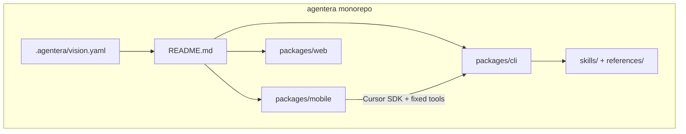

# Agentera consolidation and monorepo plan

> Authoritative design doc for the product pivot and monorepo consolidation.
> Decision 67 (2026-06-05) records the chosen direction. The docs/artifacts pass
> landed 2026-06-05; application scaffolding in `packages/mobile` remains
> downstream work tracked in `packages/mobile/TODO.md`.

## Summary

Agentera is repositioning from an **open protocol with runtime adapters** as the
public story to an **opinionated mobile-first coding agent** as a single product
brand. The [jgabor/agentera](https://github.com/jgabor/agentera) repository is
the home for all product surfaces:

| Package           | npm name           | Role                                                                |
| ----------------- | ------------------ | ------------------------------------------------------------------- |
| `packages/mobile` | `@agentera/mobile` | **Flagship product** — SvelteKit app, Cursor SDK, Cloudflare Worker |
| `packages/web`    | `@agentera/web`    | Marketing site and published Starlight docs                         |
| `packages/cli`    | `agentera`         | Agent runtime and `.agentera/` project-state CLI                    |

The same fixed workflow ships through mobile, web, CLI, and editor skill/plugin
runtimes (Decision 68). **Decision 69 (firm, 2026-06-07)** records the load-bearing
invariant: `packages/cli` owns capability schema, `.agentera/` state contract, and
agent execution routing; all surfaces are clients. Editor delivery is one composite
surface (`SKILL.md` + runtime hooks + `agentera` CLI). Schema contracts in
`skills/` and `references/` power every surface — implementation authority, not
a separate protocol brand.

The former standalone [agentera-mobile](https://github.com/jgabor/agentera-mobile)
repo was a staging ground for product vision and docs. Its content now lives in
`packages/mobile/`; that repo’s README redirects here.

## Reference model

Two open-source monorepos informed this layout:

| Pattern          | T3 Code                            | Pi                                                   | Agentera                                                                                                          |
| ---------------- | ---------------------------------- | ---------------------------------------------------- | ----------------------------------------------------------------------------------------------------------------- |
| Root README      | Product-first (“minimal web GUI…”) | Package table + monorepo index                       | Product home + `@agentera/*` table                                                                                |
| Package README   | Split across `docs/`               | Full philosophy in `packages/coding-agent/README.md` | Philosophy in `packages/mobile/README.md`                                                                         |
| Scoped npm names | `t3` (npx)                         | `@earendil-works/pi-*`                               | `@agentera/mobile`, `@agentera/web`; CLI publishes as `agentera`                                                  |
| Extensibility    | Fixed GUI over providers           | Highly extensible (opposite of mobile)               | All surfaces: **no user extensions**; editor skill/plugin runtimes are **delivery surfaces**, not extension hosts |

Agentera follows **Pi’s monorepo shape** and **T3’s single-consumer-product
clarity**.

## Goals

1. **One brand** — “Agentera” everywhere (app, monorepo, `.agentera/` dot-folder).
2. **Mobile leads** — phone-shaped UX (smart bar, queue, paste, rewind) is the
   design language; desktop is a responsive layout.
3. **Monorepo cohesion** — shared vision, vocabulary, and design surface register;
   package READMEs own surface-specific DX.
4. **Preserve delivery surfaces** — mobile, CLI, web, and editor skill/plugin
   runtimes stay working; schema contracts power every surface.
5. **Traceable migration** — staging repo → `packages/mobile` with redirect;
   decisions and plan artifacts record rationale.

## Non-goals (this pass)

- Renaming capability schema IDs (`hej` → `brief`) — docs alias table only
- Removing `skills/`, runtime adapters, or npm skill bundle
- Publishing `@agentera/mobile` to npm (workspace-private until decided)
- Starlight product pages on `packages/web` (follow-up)
- Defining CLI ↔ mobile integration (does mobile call `agentera prime` or embed
  its own state machine?) — open follow-up

## Monorepo layout

```text
agentera/
├── .agentera/
│   └── vision.yaml          # Single ecosystem + product north star (merged)
├── README.md                # Product home, package table, quick start
├── AGENTS.md                # Contributor rules; mobile + web + cli DX
├── DESIGN.md                # Terminal surface register + tokens
├── package.json             # vp run mobile:* / web:* workspace shortcuts
├── pnpm-workspace.yaml      # packages/*
├── packages/
│   ├── mobile/              # @agentera/mobile — flagship app
│   │   ├── README.md
│   │   ├── DESIGN.md        # Mobile UI design system
│   │   ├── AGENTS.md
│   │   └── package.json
│   ├── web/                 # @agentera/web — Astro + Starlight
│   └── cli/                 # agentera npm CLI + bundled skills/references
├── skills/agentera/         # Internal skill bundle (editor runtimes)
└── references/              # Internal schemas, adapters, vocabulary
```



## Identity and naming

### Product brand

| Term                                 | Meaning                                                   |
| ------------------------------------ | --------------------------------------------------------- |
| **Agentera**                         | The product — app, monorepo, user-facing docs             |
| **`@agentera/mobile`**               | Workspace package for the mobile/web app                  |
| **`@agentera/web`**                  | Workspace package for the marketing/docs site             |
| **`@agentera/cli`** / **`agentera`** | Agent runtime and state CLI (npm package name `agentera`) |
| **`.agentera/`**                     | User project state directory (like Pi’s `.pi/`)           |

Retired as **public headline**: "open protocol for turning AI agents into
engineering teams" and "opinionated mobile-first coding agent." Replaced by
"turn your coding agent into an engineering team." Internal docs may still
describe schemas and CLI mechanics.

### Vision placement

**Chosen:** single root [`.agentera/vision.yaml`](../../.agentera/vision.yaml)
absorbs mobile north star, principles, and direction. `packages/mobile/README.md`
holds package-specific philosophy and UI conventions — no long-term duplicate
vision file in the mobile package.

### Capability names

Mobile UX uses **English aliases**; CLI and schemas retain **Swedish `-era` IDs**.

| Glyph | User-facing (mobile) | Internal    |
| :---: | -------------------- | ----------- |
|   ⌂   | brief                | hej         |
|   ⛥   | vision               | visionera   |
|   ❈   | discuss              | resonera    |
|   ⬚   | research             | inspirera   |
|   ≡   | plan                 | planera     |
|   ⧉   | build                | realisera   |
|   ⎘   | optimize             | optimera    |
|   ▤   | document             | dokumentera |
|   ◰   | design               | visualisera |
|   ⛶   | audit                | inspektera  |
|   ♾   | profile              | profilera   |
|   ⎈   | orchestrate          | orkestrera  |

Canonical alias table: [`packages/mobile/README.md`](../../packages/mobile/README.md).
A full schema rename is a separate future decision (D58 single-name boundary).

### Extensibility

| Surface                    | Policy                                                                                                                                                                                                                                                                                                                                                                                                                               |
| -------------------------- | ------------------------------------------------------------------------------------------------------------------------------------------------------------------------------------------------------------------------------------------------------------------------------------------------------------------------------------------------------------------------------------------------------------------------------------ |
| **Mobile app**             | No extensions, plugins, MCP servers, or skill loading — ever. Custom sidebar actions are app-defined shortcuts, not arbitrary extension surfaces. **Client of `packages/cli`** (Decision 69); presentation-only tiering allowed.                                                                                                                                                                                                     |
| **CLI**                    | Agent runtime and `.agentera/` state access — the **narrow waist** (Decision 69). All agent execution routes through CLI or `agentera serve`; provider SDKs are adapters behind CLI.                                                                                                                                                                                                                                                 |
| **Editor-runtime surface** | **Composite delivery surface** (Decision 69): `skills/agentera/SKILL.md` (discoverability + routing stub) + runtime-native hooks (lifecycle injection) + `agentera` CLI binary (engine). Same twelve-capability workflow in Cursor, Claude, OpenCode, Codex, Copilot — not user extensibility; hooks delegate validation to CLI. Documented under README **Internals** and [`packages/cli/README.md`](../../packages/cli/README.md). |

## Design surfaces

Decision 62 brand-vs-product register, implemented as a **surface register** in
[`DESIGN.md`](../../DESIGN.md):

| Surface    | Authority                   | Renders                                                     |
| ---------- | --------------------------- | ----------------------------------------------------------- |
| `terminal` | Root `DESIGN.md`            | CLI dashboard, capability intros, Markdown artifact headers |
| `mobile`   | `packages/mobile/DESIGN.md` | Touch UI, smart bar, sidebar, chat composer                 |

Shared: product name, capability glyphs, sharp-colleague voice.
Not shared: box-drawing logo scarcity rules (terminal), Tailwind touch targets (mobile).

## Workspace and DX

Root [`package.json`](../../package.json) shortcuts (Vite+ / `vp`):

```bash
vp run mobile:dev
vp run mobile:check
vp run mobile:build
vp run mobile:deploy

vp run web:dev
vp run web:check
vp run web:build
vp run web:deploy
```

[`AGENTS.md`](../../AGENTS.md) defines commit scopes `mobile`, `web`, `cli`.
[`.lefthook.yml`](../../.lefthook.yml) runs `vp staged` in `packages/mobile` and
`packages/web` on staged file changes (mirrors web hook pattern).

## Documentation authority

| Layer                                                                | Role                                                    |
| -------------------------------------------------------------------- | ------------------------------------------------------- |
| [`.agentera/vision.yaml`](../../.agentera/vision.yaml)               | Product north star                                      |
| [`README.md`](../../README.md)                                       | Product home and package index                          |
| [`packages/mobile/README.md`](../../packages/mobile/README.md)       | Mobile product philosophy, UI conventions, dev commands |
| [`packages/mobile/DESIGN.md`](../../packages/mobile/DESIGN.md)       | Mobile UI design system                                 |
| [`packages/web/README.md`](../../packages/web/README.md)             | Web site DX; Starlight is published docs layer          |
| [`packages/cli/README.md`](../../packages/cli/README.md)             | CLI channels, upgrade, editor runtime install pointer   |
| [`references/cli/vocabulary.md`](../../references/cli/vocabulary.md) | Terminology index (product grammar updated 2026-06-05)  |
| **`docs/consolidation/`** (this file)                                | Consolidation plan and migration checklist              |
| **`docs/packaging/`**                                                | v3 CLI distribution contract (separate track)           |

[`packages/web/src/content/docs/`](../../packages/web/src/content/docs/) remains
the **published** documentation layer. Protocol changes land in `references/` or
`skills/` first; Starlight pages migrate incrementally.

## Completed work (2026-06-05 docs pass)

### Monorepo (`jgabor/agentera`)

- [x] Merged product vision into `.agentera/vision.yaml`
- [x] Pi-style root `README.md` with package table and Internals section
- [x] `AGENTS.md` — monorepo table, `mobile`/`web` scopes, Package DX
- [x] `package.json` — `mobile:*` scripts
- [x] `DESIGN.md` — surface register (`terminal` vs `mobile`)
- [x] `.agentera/docs.yaml` — index entries for `packages/mobile`, web, cli
- [x] `.agentera/decisions.yaml` — Decision 67, Decision 68; staging D1–D5 archived
- [x] `references/cli/vocabulary.md` (+ bundle copy) — product grammar
- [x] `skills/agentera/SKILL.md` — agent-engine framing (not “open protocol”)
- [x] `packages/mobile/` stub — README, AGENTS, DESIGN, TODO, CHANGELOG, `package.json`
- [x] `.lefthook.yml` — `packages/mobile` pre-commit hook
- [x] `packages/web/README.md` — content authority includes mobile

### Staging repo (`agentera-mobile`)

- [x] Product vision, README, capability alias table
- [x] Project artifacts: `docs.yaml`, `decisions.yaml`, `plan.yaml`, `progress.yaml`
- [x] `AGENTS.md`, `DESIGN.md`, `TODO.md`, `CHANGELOG.md`, `LICENSE`
- [x] README redirect to `packages/mobile` in monorepo

## Remaining work

**Docs/artifacts closeout:** complete (progress cycle 650, commit `4a2d301b`).

Implementation items: [`packages/mobile/TODO.md`](../../packages/mobile/TODO.md).

Open decisions (CLI integration, publish identity, skill horizon, and related
ambiguities): [`mobile-open-decisions.md`](./mobile-open-decisions.md).

| Priority | Item                                                                                                                  |
| -------- | --------------------------------------------------------------------------------------------------------------------- |
| Degraded | Scaffold SvelteKit app with Cursor SDK integration                                                                    |
| Degraded | Implement smart bar, sidebar, queue, paste, rewind                                                                    |
| Degraded | Wire lefthook/CI fully once app source exists                                                                         |
| Normal   | Publish mobile product page on Starlight (`packages/web`)                                                             |
| Normal   | Tiered model assignment table in README                                                                               |
| Open     | CLI ↔ mobile state integration strategy — see [mobile-open-decisions.md](./mobile-open-decisions.md)                  |
| Open     | npm publish identity for `@agentera/mobile` — see [mobile-open-decisions.md](./mobile-open-decisions.md)              |
| Open     | Skill bundle long-term role (coexist vs eventual sunset) — see [mobile-open-decisions.md](./mobile-open-decisions.md) |

## Physical migration checklist

When application code is ready to move from a staging checkout:

1. Ensure `packages/mobile/` has full app tree (not docs-only stub).
2. Set `"name": "@agentera/mobile"` in `packages/mobile/package.json` (done).
3. Run `pnpm install` from monorepo root; verify `vp run mobile:*` scripts.
4. Confirm `.lefthook.yml` `mobile` hook runs on staged mobile source files.
5. Remove duplicate vision from mobile package if any; root vision is canonical.
6. Archive standalone `agentera-mobile` repo (README redirect already in place).
7. Update `CHANGELOG.md` in both monorepo root and `packages/mobile` at first release.

## Decisions

| ID                                    | Date       | Topic                                                                                                                                                                                         |
| ------------------------------------- | ---------- | --------------------------------------------------------------------------------------------------------------------------------------------------------------------------------------------- |
| [D67](../../.agentera/decisions.yaml) | 2026-06-05 | Product pivot from open protocol to mobile-first single brand                                                                                                                                 |
| [D68](../../.agentera/decisions.yaml) | 2026-06-05 | Multi-surface product — same fixed workflow; editor skill/plugin runtimes are delivery surfaces, not extension hosts                                                                          |
| [D69](../../.agentera/decisions.yaml) | 2026-06-07 | Multi-surface invariant — `packages/cli` narrow waist (schema + state + execution routing); editor-runtime = skills + hooks + CLI composite                                                   |
| Staging D1–D5                         | 2026-06-05 | Archived in [`.agentera/decisions.yaml`](../../.agentera/decisions.yaml) `archive:` (naming, vision placement, aliases with provisional alias-table confidence, extensibility, monorepo path) |

## Related documents

- [v3 packaging design](../packaging/v3-packaging.md) — CLI distribution (parallel track)
- [Runtime feature parity](../../references/adapters/runtime-feature-parity.md) — editor adapter internals
- [Vocabulary](../../references/cli/vocabulary.md) — product grammar and capability terms
